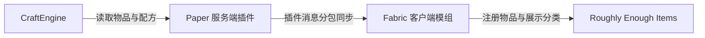

<div align="center">

# CraftEngine REI Bridge

**将服务端 CraftEngine 自定义物品与配方，准确同步到 Fabric 客户端的 REI。**


[功能特性](#功能特性) · [兼容版本](#兼容版本) · [安装方法](#安装方法) · [命令](#命令) · [自行构建](#自行构建)

</div>

---

## 项目简介

CraftEngine REI Bridge 是由 **Paper 服务端插件**与 **Fabric 客户端模组**组成的双端桥接项目。

服务端从 CraftEngine 读取已经加载的自定义物品与配方，将必要的展示数据安全分包发送给安装了配套模组的玩家；客户端收到数据后，把物品及合成、锻造、酿造配方注册到 Roughly Enough Items（REI）中。

本项目只负责展示同步，不会修改 CraftEngine 的配方逻辑，也不会将 CraftEngine、REI、Fabric API 等依赖打包进产物。



## 功能特性

- 将服务端已加载的 CraftEngine 自定义物品加入 REI 物品列表。
- 提供独立的 **CraftEngine 合成、锻造、酿造**分类。
- 支持有序合成、无序合成和精确的九宫格材料布局。
- 支持锻造模板、基础物品、附加材料与结果展示。
- 保留物品的 `custom_model_data`、`item_model` 和自定义名称。
- 同步其他 Bukkit 插件注册且涉及 CraftEngine 物品的合成、锻造配方。
- 以 `craftengine:id` 区分自定义物品和底层原版载体，避免查询时混入原版配方。
- 在 REI 中按 `R` 或左键查询 CraftEngine 物品时，直接显示对应的 CraftEngine 配方分类。
- CraftEngine 热重载后自动重建缓存，并向在线玩家推送最新数据。
- 断开服务器后自动清理已同步物品与配方，避免不同服务器之间的数据残留。
- 大型同步数据按 30 KB 分包传输，降低插件消息大小限制带来的风险。

## 兼容版本

每个 Minecraft 版本必须使用对应的客户端 JAR，三个文件不能混用。

| Minecraft | Java | Fabric Loader | Fabric API | REI | 客户端文件 |
| --- | ---: | ---: | ---: | ---: | --- |
| 1.21.11 | 21+ | 0.18.4+ | 0.141.6+1.21.11 | 21.11.816+ | `craftengine-rei-bridge-fabric-1.21.11-1.0.0.jar` |
| 26.1.2 | 25+ | 0.19.3+ | 0.155.2+26.1.2 | 26.1.819+ | `craftengine-rei-bridge-fabric-26.1.2-1.0.0.jar` |
| 26.2 | 25+ | 0.19.3+ | 0.156.0+26.2 | 26.2.821+ | `craftengine-rei-bridge-fabric-26.2-1.0.0.jar` |

### 服务端要求

- Paper 或兼容的服务端分支。
- Java 21 或更高版本。
- 已安装并正常加载 CraftEngine。
- 插件声明的 Bukkit API 版本为 `1.20`，当前构建使用 Paper `1.21.11` API 与 CraftEngine `26.7.4`。

> [!IMPORTANT]
> 服务端插件与客户端模组必须配套安装。只安装服务端插件不会让原版客户端显示 REI 内容，只安装客户端模组也无法取得服务器上的 CraftEngine 数据。

## 安装方法

### 服务端

1. 关闭服务器。
2. 确认 CraftEngine 已安装并可正常启动。
3. 将 `craftengine-rei-bridge-server-1.0.0.jar` 放入服务器的 `plugins/` 目录。
4. 启动服务器并检查控制台，确认出现 `CraftEngine REI Bridge enabled`。

服务端无需额外配置文件，安装后即可工作。

### 客户端

1. 安装与游戏版本对应的 Fabric Loader。
2. 在客户端 `mods/` 中安装 Fabric API 与 Roughly Enough Items（REI）。
3. 按照游戏版本选择对应的 `craftengine-rei-bridge-fabric-*.jar`，放入客户端 `mods/`。
4. 进入服务器，打开 REI 即可查看同步的物品与配方。

## 命令

主命令：`/cereibridge`

| 命令 | 说明 |
| --- | --- |
| `/cereibridge reload` | 重新读取 CraftEngine 数据并重建服务端同步缓存 |
| `/cereibridge resync` | 玩家执行时重新同步自己；控制台执行时重新同步所有在线玩家 |
| `/cereibridge info` | 查看物品、合成、锻造和酿造同步缓存的大小 |

管理权限：`craftengine-rei-bridge.admin`，默认仅服务器管理员拥有。

## 工作方式

1. 服务端启动时读取 CraftEngine 物品及受支持的配方并生成缓存。
2. 客户端加入服务器后通过桥接频道发起握手。
3. 服务端仅向安装了配套客户端模组的玩家发送同步数据。
4. 客户端组装分包，在 REI 中更新物品列表和三个 CraftEngine 分类。
5. CraftEngine 热重载时，服务端重新生成缓存并自动推送给在线玩家。

桥接传输的是 REI 展示所需的数据，不会把完整 CraftEngine 配置、资源包文件或服务端插件代码发送给客户端。

## 项目结构

```text
CraftEngine-REI-Bridge/
├─ server/          Paper 服务端插件
├─ fabric-common/   三个客户端版本共享的同步与 REI 逻辑
├─ fabric-1.21.11/  Minecraft 1.21.11 Fabric 适配
├─ fabric-26.1.2/   Minecraft 26.1.2 Fabric 适配
└─ fabric-26.2/     Minecraft 26.2 Fabric 适配
```

## 自行构建

项目自带 Gradle Wrapper。

### 构建全部客户端版本

```powershell
.\gradlew.bat buildFabricAll
```

也可以只构建一个版本：

```powershell
.\gradlew.bat :fabric-1.21.11:build
.\gradlew.bat :fabric-26.1.2:build
.\gradlew.bat :fabric-26.2:build
```

客户端产物位于各模块的 `build/libs/`。

### 构建服务端插件

CraftEngine 是独立的商业插件，本仓库不会分发或自动下载它。请将你合法取得的 `craft-engine-paper-plugin-*.jar` 放入 `server/libs/`，然后执行：

```powershell
.\gradlew.bat :server:build
```

服务端产物位于 `server/build/libs/`。

### 依赖策略

- CraftEngine 与 Paper API 仅作为 `compileOnly` 编译依赖。
- REI、Fabric API、Fabric Loader、Architectury 和 Cloth Config 均由客户端运行环境提供。
- 项目不使用 Shadow，也不在产物中嵌入第三方 JAR。
- 当前没有需要通过 LibaryLoader 下载的额外运行时库。

## 已知限制

- 锻造纹饰配方的最终物品由基础盔甲、材料和纹饰在运行时共同决定，不存在唯一固定结果，因此不会导出为精确展示配方。
- 本项目展示服务器同步的配方，但不会在客户端模拟或替代 CraftEngine 的实际合成判定。
- 客户端 Minecraft、Fabric API 和 REI 版本必须互相匹配。

## 问题反馈

反馈问题时，请附上以下信息：

- 服务端类型及 Minecraft 版本。
- CraftEngine 版本。
- 客户端 Fabric Loader、Fabric API 与 REI 版本。
- 服务端控制台和客户端日志中的完整报错。
- 能够复现问题的物品或配方 ID。

作者：**MoutainSeaL**  
QQ：`3643203568`  
QQ 群：`342097496`

## 许可与致谢

本项目使用 [MIT License](LICENSE)。CraftEngine 是独立的商业产品，不包含在本仓库及本项目许可证中。

项目参考并包含部分来自 [TH2403y/CE-JEI-Bridge](https://github.com/TH2403y/CE-JEI-Bridge) 的 MIT License 代码，详细归属信息请参阅 [NOTICE](NOTICE)。
